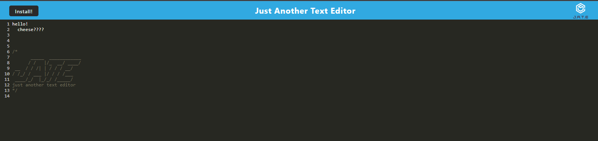

# PWA-Text-Editor

## Table of Contents

- [Description](#description)
- [Installation](#installation)
- [Usage](#usage)
- [Credits](#credits)

## Description

This application is a offline text editor. It functions both online and offline when installed onto the user's device. It is a simple text editor meant to save the user's text.

## Installation

The user will need to click the install button on the page to install the application onto their device.

## Usage

To use this app, the user must type into the text field. The application will save the text to the database and retrieve it upon refresh of the page.

Screen shot of page:

To use the application visit here: https://secret-reaches-73387-a8bff4504340.herokuapp.com/

## Credits

For any questions, please contact me via the channels below:
* Github: https://github.com/kaylaasana
* E-mail: kayladatte@gmail.com